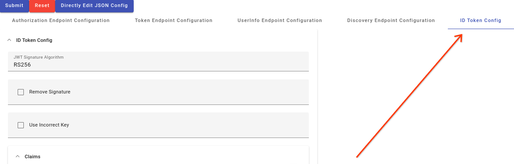
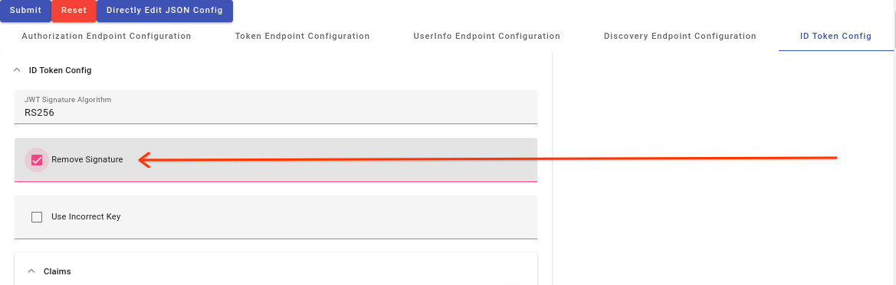
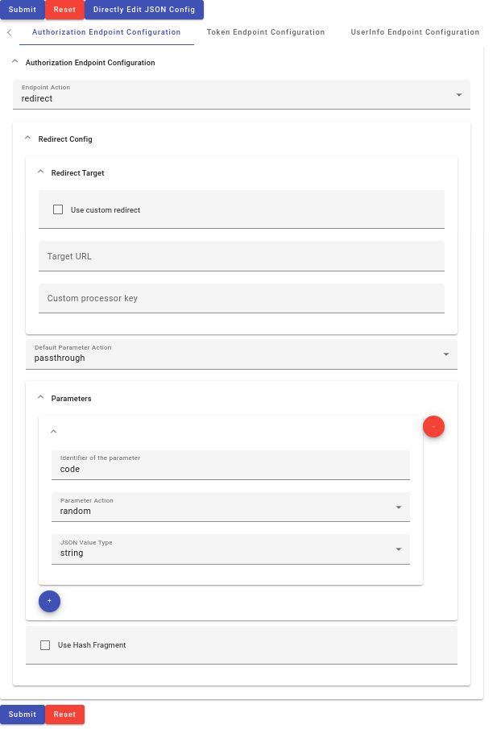
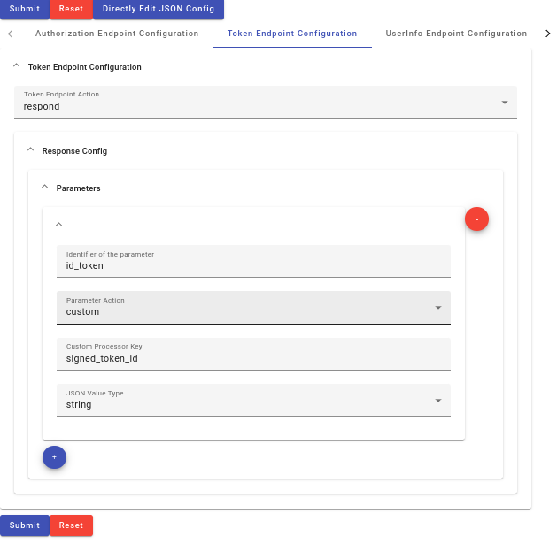
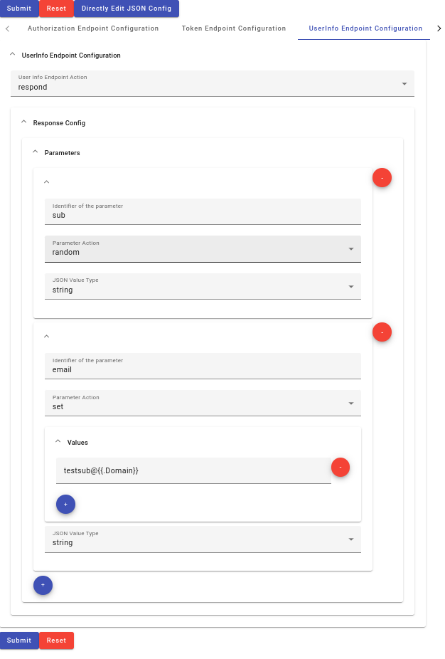
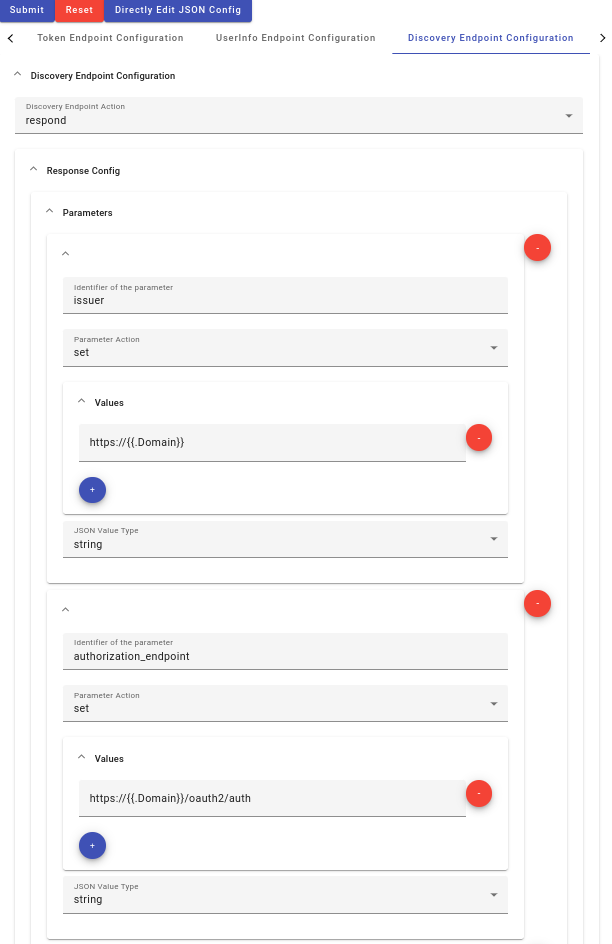
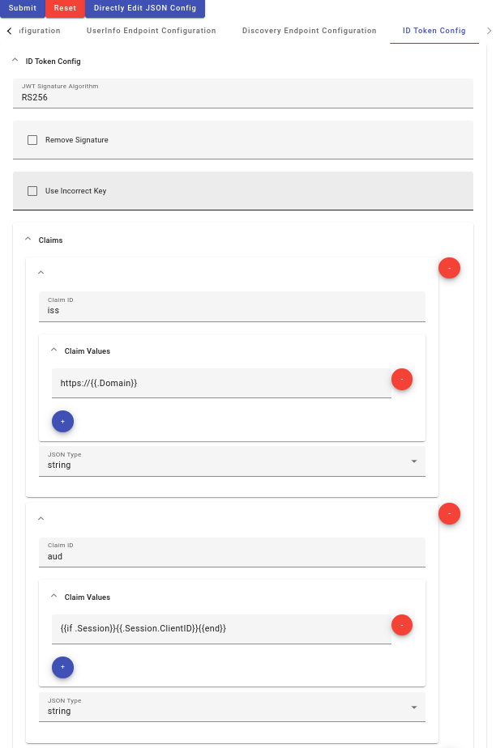

# Pseudo Identity Provider

**Note:** This is not an officially supported Google product.

Pseudo IdP is a simple, **fake**,
[OAuth2](https://datatracker.ietf.org/doc/html/rfc6749) or
[OIDC](https://openid.net/specs/openid-connect-core-1_0.html) Identity Provider.
It exposes the standard OIDC Discovery, Authorization, Token, and UserInfo
endpoints, allowing for custom behavior at each configured through a web UI.

Test that your OAuth/OIDC clients perform all of their required security checks
by configuring the Pseudo IdP to misbehave. You can return invalid token
signatures, incorrect or missing CSRF token state and nonces, or test for more
complicated Mix-Up attacks for clients that support multiple IdPs.

## Initial Setup

### Build the Angular Frontend

First you will need to build the front end components. Make sure you have
[npm](https://docs.npmjs.com/cli/v10/configuring-npm/install) and the
[Angular CLI](https://angular.io/cli#installing-angular-cli) installed.

Then, from the source root, run these commands to install necessary npm nodes
and build the frontend.

```
cd ./frontend
npm install
ng build
```

### Deploying the service

Psuedo IdP can run either as a Google Cloud
[App Engine Service](https://cloud.google.com/appengine/docs/standard) or as a
standalone Go binary. Running on the App Engine Standard platform gives you the
HTTPS support required by most OAuth clients without any additional setup. If
you want to host the service via other methods of your choosing you will likely
have to setup HTTPS endpoints via NGINX or some other means.

#### Deploying to App Engine

To deploy to App Engine, first install the
[GCloud CLI](https://cloud.google.com/appengine/docs/standard/go/building-app#setting_up_your_development_environment)
and
[create a Project (steps 1-5)](https://cloud.google.com/appengine/docs/standard/go/building-app#create_project)
to host the service.

Once your GCP Project is created and configured, you can deploy the app by
moving to the src directory and using `gcloud`. But first, let's setup a
password by running

```
cd ./src/hash
go run hash_salt.go
```

Enter a password and then set the resulting hash and a username in the
`src/app.yaml` file in the environment variables section.

```
env_variables:
  LOG_USERNAME: test
  LOG_PASSWORD: $2a$10$ze/6a6kINJkz4fUjYUSWnuTElSotXF9VS9ziqQpKNv/6tOt84Y6K2
```

Now we can deploy the app using

```
cd ./src
gcloud app deploy
```

once that is complete running the browse command will launch a browser to your
running instance

```
gcloud app browse -s pseudoidp
```

#### Running as a Standalone Server

To start the standalone server the src directory and running the standalone go
program. This is convenient if you would like to test locally or if you would
like to use your own hosting solution. But first, let's setup a password by
running

```
cd ./src/hash
go run hash_salt.go
```

Enter a password and then set the resulting hash and a username in your
environment variables with the hash in single quotes.

```
export LOG_USERNAME=test
export LOG_PASSWORD='$2a$10$s/jpYKi4n7NnKbpw/JKIX.GSVVId3lla6FbbnkECAMUnVh1azvnYm'
```

Then run the standalone module to start the server.

```
cd ./src
go run ./standalone/standalone_main.go
```

## Testing it out

Test out your newly deployed Pseudo IdP with the OIDC Debugger client at
https://openidconnect.net/.

Pseudo IdP's default configuration mimics a valid OIDC IdP. To configure the
OIDC Debugger, click the `Configuration` button and enter the OIDC discover
document URL for your deployment
`https://<your-domain>/.well-known/openid-configuration`. Press `Use Discover
Document` to auto-populate the other fields and `Save`. Then follow various
steps to test out the OIDC flow, exchange an auth code, and verify the token.
The site also links to https://jwt.io where you can inspect the JWT further.

You can view the requests and responses the IdP makes at
`https://<your-domain>/log`. Log in with the username and password you set while
deploying the application. The log is useful for debugging how the client
interacts with the IdP and to ensure the IdP is responding as you expect.

## Using Pseudo IdP for Security Testing

The power of the tool comes from modifying its behavior to test the security
guarantees of the client. As an example, let's see how the OIDC Debugger client
behaves when the Pseudo IdP return invalid signatures.

First, load up the configuration management UI at `https://<your-domain>/`. You
will see multiple configuration tabs across the top of the screen. Select `ID
Token Config` to modify the content of the JWT ID Token.



Press the checkbox next to `Remove Signature` and click the `Submit` button to
update the configuration. This setting strips the signature element of the JWT
Token. Accepting JWTs with empty signature elements was the root cause of
[CVE-2020-28042](https://nvd.nist.gov/vuln/detail/CVE-2020-28042), so this is a
real issue that existed in the wild. You can learn more about the JWT format at
[jwt.io](https://jwt.io/introduction).



Now let's see how the OIDC Debugger handles our incorrectly signed JWT. Navigate
to https://openidconnect.net/ and try the flow again.

Press the `Verify` button after receiving the token you'll see that the token
verification fails. Inspecting the error code further in your browser's
developer tools, we can see that the returned error says `jwt signature is
required`, so we've learned that the OIDC Debugger client properly handles JWTs
with missing signatures. If it did accept those JWTs, and it wasn't just a test
service, that would be a serious security issue that would need to be mitigated.

Check out the [Example Configurations](#example_configurations) section for many more example tests.

## Configuration Options

### Directly Editing JSON Config

You can also edit the JSON formatted configuration by pressing the `Directly
Edit JSON Config` button. This is useful for copying and saving a configuration
or loading a saved configuration, while updates via the forms is likely easier
for exploratory use. You can return to the forms view by pressing the `Edit
Config with Forms` button.


### Authorization Endpoint

The
[Authorization Endpoint](https://datatracker.ietf.org/doc/html/rfc6749#section-3.1)
is a client's first stop in a typical OAuth/OIDC flow. For Pseudo IdP it is at
https://<your-domain>/oauth2/auth. A normal IdP receiving an authorize request
would authenticate the user and ask consent to grant the requesting client
access to the user's resources. Then it would redirect the user's browser back
to the client's callback endpoint. Pseudo IdP ignores the authentication step
and has three modes of operation. It can `redirect` the user's browser to some
endpoint, either based on URL parameters or custom configured redirect options.
This is useful to test for Login CSRF, Mix-up attacks, or others where the
client should perform some validation at its callback. It can also return an
`error` or it can `block` the request and timeout.

The OIDC Spec has a
[summary](https://openid.net/specs/openid-connect-core-1_0.html#AuthorizationEndpoint)
of authorization endpoint parameters for OAuth2 and the OIDC extensions.



*   **Endpoint Action** - Determines how the /oauth2/auth endpoint behaves.

    *   `redirect` returns a 302 HTTP redirect with a location and parameters
        based on the configuration.
    *   `error` returns a specified HTTP error code.
    *   `block` sleeps on receiving the request causing it to time out.

*   **Redirect Config**

    *   **Redirect Target**

        *   **Use custom redirect** - By default, the redirect target is defined
            in the `redirect_uri` input parameter. Selecting `Use custom
            redirect` allows you to specify a custom redirect URI and ignore the
            input value.

        *   **Target URL** - Specify a custom redirect URL if `Use custom
            redirect` is selected.

        *   **Custom processor key** - A
            [custom processor](#adding-custom-parameters) key value for
            customized evaluation of the redirect uri.

    *   **Default Parameter Action**

        *   `passthrough` keeps parameters received in the input URL on the
            redirect URL unless otherwise configured in the `Parameters`
            section.
        *   `omit` does not include any parameters in the redirect URL unless
            configured in the `Parameters` section.

    *   **Parameters** - Add parameter configuration with the `+` button. Remove
        them with the `-` button.

        *   **Identifier of the parameter** - The name of the parameter.
        *   **Parameter Action** - How the output parameter value is determined.
            *   `passthrough` keeps the value as it is on the input URL.
            *   `set` sets the output parameter to a configured value. Set
                supports [templated parameters](#templated_parameters) that can
                access various server and request properties.
            *   `omit` does not include the parameter in the output.
            *   `random` sets the parameter to a random base64 string.
            *   `custom` uses a [custom processor](#adding-custom-parameters) to
                evaluate the parameter.
        *   **JSON Value Type** - This is ignored for the Authorization
            endpoint, but is used in other endpoints that return JSON data.

    *   **Use Hash Fragment** - Put all parameters in the
        [URL Hash Fragment](https://en.wikipedia.org/wiki/URI_fragment). This is
        useful for Implicit flows or clients that are otherwise expecting hash
        frament parameters.

### Token Endpoint

The [Token Endpoint](https://datatracker.ietf.org/doc/html/rfc6749#section-3.2)
takes in a authorization grant or refresh token and returns an access token,
maybe a refresh token, and for OIDC, an
[Identity Token](https://openid.net/specs/openid-connect-core-1_0.html#TokenResponse).
For Pseudo IdP it is at https://<your-domain>/oauth2/token



*   **Endpoint Action** - Determines how the /oauth2/token endpoint behaves.

    *   `redirect` returns a successful token response with parameters based on
        the configuration.
    *   `error` returns a specified HTTP error code.
    *   `block` sleeps on receiving the request causing it to time out.

*   **Response Config**

    *   **Parameters** - Add parameter configuration with the `+` button. Remove
        them with the `-` button.
        *   **Identifier of the parameter** - The name of the parameter.
        *   **Parameter Action** - How the output parameter value is determined.
            *   `passthrough` keeps the value as it is on the input URL.
            *   `set` sets the output parameter to a configured value. Set
                supports [templated parameters](#templated_parameters) that can
                access various server and request properties.
            *   `omit` does not include the parameter in the output.
            *   `random` sets the parameter to a random base64 string.
            *   `custom` uses a [custom processor](#adding-custom-parameters) to
                evaluate the parameter.
        *   **JSON Value Type** - A value is assumed to have the string type
            unless this is set to a non-string value.
            *   `string` the set value is interpreted as a string. This is the
                default.
            *   `array` the value is interpreted as an array of strings.
            *   `number` the value is interpreted as a number. It must
                successfully parse as a number.
            *   `boolean` the value is interpreted as a boolean value. It must
                be `true` or `false`.
            *   `object` the value is interpreted as a JSON object. The value
                must be JSON formatted text.

### UserInfo Endpoint

The OIDC UserInfo endpoint returns additional user info. For Pseudo IdP it is at
https://<your-domain>/oauth2/userinfo.



*   **Endpoint Action** - Determines how the /oauth2/userinfo endpoint behaves.

    *   `redirect` returns a successful userinfo response with parameters based
        on the configuration.
    *   `error` returns a specified HTTP error code.
    *   `block` sleeps on receiving the request causing it to time out.

*   **Response Config**

    *   **Parameters** - Add parameter configuration with the `+` button. Remove
        them with the `-` button.
        *   **Identifier of the parameter** - The name of the parameter.
        *   **Parameter Action** - How the output parameter value is determined.
            *   `passthrough` keeps the value as it is on the input URL.
            *   `set` sets the output parameter to a configured value. Set
                supports [templated parameters](#templated_parameters) that can
                access various server and request properties.
            *   `omit` does not include the parameter in the output.
            *   `random` sets the parameter to a random base64 string.
            *   `custom` uses a [custom processor](#adding-custom-parameters) to
                evaluate the parameter.
        *   **JSON Value Type** - A value is assumed to have the string type
            unless this is set to a non-string value.
            *   `string` the set value is interpreted as a string. This is the
                default.
            *   `array` the value is interpreted as an array of strings.
            *   `number` the value is interpreted as a number. It must
                successfully parse as a number.
            *   `boolean` the value is interpreted as a boolean value. It must
                be `true` or `false`.
            *   `object` the value is interpreted as a JSON object. The value
                must be JSON formatted text.

### Discovery Doc Endpoint

OIDC specifies a
[Discovery Endpoint](https://openid.net/specs/openid-connect-discovery-1_0.html#IssuerDiscovery)
that tells a client where the Authorization, Token and other endpoints are
located.



*   **Endpoint Action** - Determines how the /.well-known/openid-configuration
    endpoint behaves.

    *   `redirect` returns a successful discovery response with parameters based
        on the configuration.
    *   `error` returns a specified HTTP error code.
    *   `block` sleeps on receiving the request causing it to time out.

*   **Response Config**

    *   **Parameters** - Add parameter configuration with the `+` button. Remove
        them with the `-` button.
        *   **Identifier of the parameter** - The name of the parameter.
        *   **Parameter Action** - How the output parameter value is determined.
            *   `passthrough` keeps the value as it is on the input URL.
            *   `set` sets the output parameter to a configured value. Set
                supports [templated parameters](#templated_parameters) that can
                access various server and request properties.
            *   `omit` does not include the parameter in the output.
            *   `random` sets the parameter to a random base64 string.
            *   `custom` uses a [custom processor](#adding-custom-parameters) to
                evaluate the parameter.
        *   **JSON Value Type** - A value is assumed to have the string type
            unless this is set to a non-string value.
            *   `string` the set value is interpreted as a string. This is the
                default.
            *   `array` the value is interpreted as an array of strings.
            *   `number` the value is interpreted as a number. It must
                successfully parse as a number.
            *   `boolean` the value is interpreted as a boolean value. It must
                be `true` or `false`.
            *   `object` the value is interpreted as a JSON object. The value
                must be JSON formatted text.

### ID Token Config

The ID Token configuration drives a
[custom processor](#adding-custom-parameters) to create and sign a
[JWT](https://jwt.io/). In the default configuration, this is used by the Token
Endpoint configuration to set the `id_token` parameter.



*   **JWT Signature Algorithm** - Sets the signature algorithm for the JWT.
    Available options are `RS256`. `RS384`. `RS512`. `ES256`, `ES384`, `ES512`,
    `HS256`, and `none`.

*   **Remove Signature** - Remove the signature component of the JWT.

*   **Use Incorrect Key** - Sign the token with a key that is the requested
    type, but is not in the service's /.well-known/jwks.json file.

*   **Claims** - Add claims configuration with the `+` button. Remove them with
    the `-` button.

    *   **Claim ID** - The name of the claim.
    *   **Claim Values** - One or more values for a claim. Supports
        [templated parameters](#templated_parameters) that can access various
        server and request properties.
    *   **JSON Value Type** - A value is assumed to have the string type unless
        this is set to a non-string value.
        *   `string` the set value is interpreted as a string. This is the
            default.
        *   `array` the value is interpreted as an array of strings.
        *   `number` the value is interpreted as a number. It must successfully
            parse as a number.
        *   `boolean` the value is interpreted as a boolean value. It must be
            `true` or `false`.
        *   `object` the value is interpreted as a JSON object. The value must
            be JSON formatted text.

### Templated Parameters

Parameters in `set` mode and Claims support
[Go templates](https://pkg.go.dev/text/template). The template evaluation can
access data in the `RequestInput` data structure.

*   **Domain** - The domain name of the IdP service.
*   **HTTPMethod** - The HTTP method called. GET, POST, etc.
*   **Path** - The URL Path for the request.
*   **Proto** - The URL proto, HTTP, HTTPS, etc.
*   **Headers** - Array of HTTP Headers from the request.
*   **URLParams** - URL Parameters.
*   **FormParams** - Form parameters for POST requests.
*   **Session** - Persisted session details key'd by the Auth Code.
    *   **Code** - The Auth Code.
    *   **Nonce** - The OIDC Nonce if specified.
    *   **CodeChallenge** - The PKCE Code challenge if specified.
    *   **CodeChallengeMethod** - The PKCE Code challenge method if specified.
    *   **ClientID** - The Client ID from the Authorization request.
    *   **RedirectURI** - The requested redirect URI.
*   **Time** - Request time in the Go [Time](https://pkg.go.dev/time#Time) type.

#### Template Examples

The default configuration for the Discover endpoint uses multiple templates to
create the various endpoint URLs for the current domain.

```
https://{{.Domain}}/oauth2/token
```

The default ID Token configuration sets the `nonce` claim based on the input
session nonce if it is available.

```
{{if .Session}}{{.Session.Nonce}}{{end}}
```

The default expiration of the token is set to one day from the request time.

```
{{with $tomorrow := .Time.AddDate 0 0 1}}{{$tomorrow.Unix}}{{end}}
```

## Example Configurations

### CSRF Defenses (State Field Replacement)

Most clients use the state field for
[CSRF protection](https://datatracker.ietf.org/doc/html/draft-ietf-oauth-security-topics#section-2.1)
and other state tracking. The default configuration passes this parameter
through as is, but you can modify it to check that the client is verifying the
state. Below is the JSON representation of that configuration. You can do the
same from the UI by adding a Parameter config to the Authorization Endpoint to
modify the 'state' parameter.

```
{
  "auth_action": {
    "action_type": "redirect",
    "redirect": {
      ...
      "parameters": [
        ...
        {
          "id": "state",
          "action": "set",
          "values": [
            "nottherealstate"
          ],
          "custom_key": "",
          "json_type": ""
        }
      ],
    }
  }
  ...
}
```

### Invalid Nonce

The client must check the ID Token nonce value in OIDC flows. You can verify
this by changing the nonce claim generated in the ID Token Configuration.

```
{
    "id": "nonce",
    "values": [
        "unexpectednonec"
    ],
    "json_type": "string"
},
```

### Expired Token

Change the `exp` claim to be in the past.

```
{
    "id": "exp",
    "values": [
        "{{with $tomorrow := .Time.AddDate 0 0 -1}}{{$tomorrow.Unix}}{{end}}"
    ],
    "json_type": "number"
},
```

### Alg:None Attack CVE-2015-9235

Some JWT Signature verifications have had issues with the None signature type.
Current guidance is to block any use of the `none` algorithm type.

```
"alg": "none",
```

### Key Confusion CVE-2016-5431

Pseudo IdP uses the RSA Public Key as the secret for the HS256 signing algorithm
to replicate CVE-2016-5431.

```
"alg": "HS256",
```

### Null Signature CVE-2020-28042

Select the "Remove Signature" option in the ID Token Config section and the
signature segment of the JWT is removed.

### Incorrect Issuer

The Client must validate the issuer claim.

```
{
    "id": "iss",
    "values": [
        "https://nottheissuereryouwerelookingfor.com"
    ],
    "json_type": "string"
},
```


### OAuth2 Mix-up Attack

In a
[Mix up attack](https://datatracker.ietf.org/doc/html/draft-ietf-oauth-security-topics#section-4.4),
one provider tricks the client into sending it an authorization code or token
from another provider. In this case we have the Authorization endpoint redirect
the user to a different OAuth2 Identity Provider, fixing the Client ID value and
omitting the Nonce, if any.
[Daniel Fett's blog](https://danielfett.de/2020/05/04/mix-up-revisited/) has
in-depth coverage of Mix-up Attacks and mitigations.


```
"auth_action": {
        "action_type": "redirect",
        "redirect": {
            "redirect_target": {
                "use_custom_redirect_uri": true,
                "target": "https://honestidp/auth",
                "custom_key": ""
            },
            "default_parameter_action": "passthrough",
            "parameters": [
                {
                    "id": "client_id",
                    "action": "set",
                    "values": [
                        "clientidathonestidp"
                    ],
                    "custom_key": "",
                    "json_type": ""
                },
                {
                    "id": "nonce",
                    "action": "omit",
                    "values": null,
                    "custom_key": "",
                    "json_type": ""
                }
            ]
        },
        "error": {
            "error_code": 0,
            "error_content": ""
        }
    },
    "token_action": {
        "action_type": "block",
        "respond": {
            "parameters": null
        },
        "error": {
            "error_code": 0,
            "error_content": ""
        }
    },
```

### Mix-up with Chosen Nonce Attack

The use of a Nonce value by the Client and the Identity Provider prevents the
Mix Up version above, however the issue still exists using a Chosen Nonce
variation. Here a session is started with the valid IdP and the nonce from that
transaction is inserted into the flow for the Pseudo IdP.


```
"auth_action": {
        "action_type": "redirect",
        "redirect": {
            "redirect_target": {
                "use_custom_redirect_uri": true,
                "target": "https://honestidp/auth",
                "custom_key": ""
            },
            "default_parameter_action": "passthrough",
            "parameters": [
                {
                    "id": "client_id",
                    "action": "set",
                    "values": [
                        "clientidathonestidp"
                    ],
                    "custom_key": "",
                    "json_type": ""
                },
                {
                    "id": "nonce",
                    "action": "set",
                    "values": "chosennonce",
                    "custom_key": "",
                    "json_type": ""
                }
            ]
        },
        "error": {
            "error_code": 0,
            "error_content": ""
        }
    },
    "token_action": {
        "action_type": "block",
        "respond": {
            "parameters": null
        },
        "error": {
            "error_code": 0,
            "error_content": ""
        }
    },
```

### Implicit Flow Setup

The Pseudo IdP can also be configured to perform the
[OAuth2 Implicit Flow](https://datatracker.ietf.org/doc/html/rfc6749#section-1.3.2).

```
"auth_action": {
    "action_type": "redirect",
    "redirect": {
        "redirect_target": {
            "use_custom_redirect_uri": false,
            "target": "",
            "custom_key": ""
        },
        "default_parameter_action": "passthrough",
        "parameters": [
            {
                "id": "id_token",
                "action": "custom",
                "values": null,
                "custom_key": "signed_token_id",
                "json_type": ""
            },
            {
                "id": "access_token",
                "action": "random",
                "values": null,
                "custom_key": "",
                "json_type": ""
            },
            {
                "id": "token_type",
                "action": "set",
                "values": [
                    "Bearer"
                ],
                "custom_key": "",
                "json_type": ""
            },
            {
                "id": "expires_in",
                "action": "set",
                "values": [
                    "3600"
                ],
                "custom_key": "",
                "json_type": ""
            }
        ]
    },
    "error": {
        "error_code": 0,
        "error_content": ""
    }
},
```

## Development

### Adding Custom Parameters

You can add custom parameter evaluation function to Pseudo IdP's Go backend
implementation when more complex parameter computation is needed. As an example,
the generation of the ID Token in the default configuration is done by a custom
parameter in `src/config/idtoken.go`.

A custom parameter evaluation function takes in information about the request
and the current backend configuration and returns either an error if processing
failed, or one or more strings of output.

```
func(input *sessionmgmt.RequestInput, config *Config) ([]string, error)
```

To add a new custom parameter, follow these steps:

1.  Add a new Go file in the `src/config` directory. Name it something that
    represents what your parameter will evaluate. Add it to the `config`
    package.

2.  Add a `init()` function to register the parameter using the
    `RegisterCustomParam` function. The first parameter is the ID of the
    parameter that will be used in the configuration to invoke the custom
    parameter evaluation function in the second parameter.

    ```
    func init() {
        RegisterCustomParam("signed_token_id", GenerateToken)
    }
    ```

3.  Implement your custom evaluation in the function registered in step #2.

4.  Use your parameter in the configuration by selecting the `custom` Parameter
    Action and specifying your parameter's ID.

### Adding Configuration Options

You can add new configuration options as needed to the `src/config/config.go`
file. The entries in the `Config` structure are automatically converted to a
JSON Schema and loaded by the frontend HTML Forms. Adding a new config entry can
be useful if your custom parameter evaluation needs additional configurable
data. This is done as an example with the `src/config/idtoken.go` custom
parameter and the `IDTokenConfig` entry.

Each field in the `Config` structure and sub-structures should have a struct tag describing how it is converted to JSON and how it is represented in the frontend forms.

* **json:** Sets the field name in JSON.
* **jsonschema:** Allows setting JSON Schema parameters for the values.
    * **title=** The title of the field in the form.
    * **default=** The default value of the field in the form when the form is reset.
    * **enum=** Turns the form in a selection box of the options listed.
* **jsonschema_extras:** Sets additional behavioral configuration of the forms.
    * **hide**= Hide this field in the form based on a condition. Conditions only allow other fields to be compared to field values through the Javascript operators === or !==. In the example below, the Values field will be hidden whenever the Action field is not `set`

    ```
      Action    string   `json:"action" jsonschema:"title=Parameter Action,enum=passthrough,enum=set,enum=omit,enum=random,enum=custom,default=passthrough"`
      Values    []string `json:"values" jsonschema:"title=Values,default=example_value" jsonschema_extras:"hide=action !== set"`
    ```

### Running Tests

You can run the Angular Frontend tests as

```
cd ./frontend
ng test
```

You can run the backend Go tests as

```
cd ./src
go test ./ ...
```
